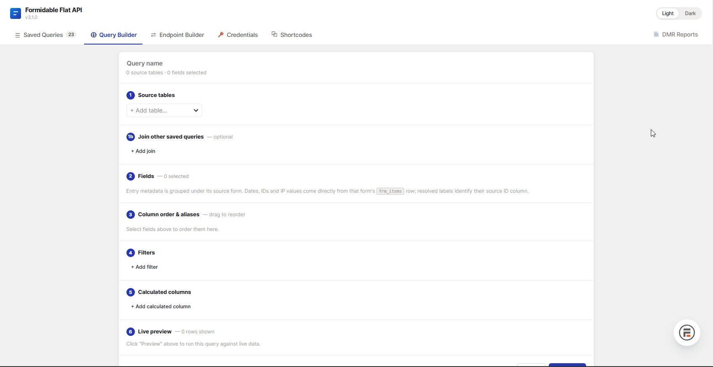
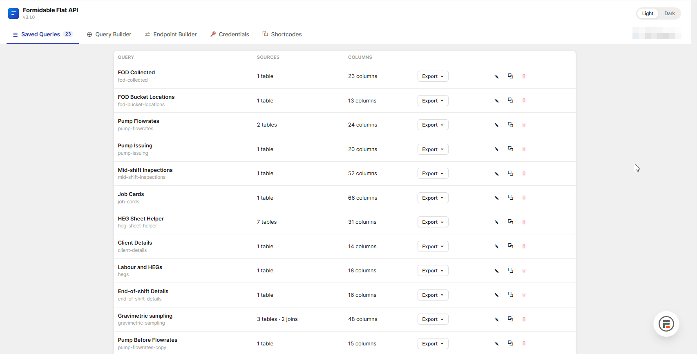
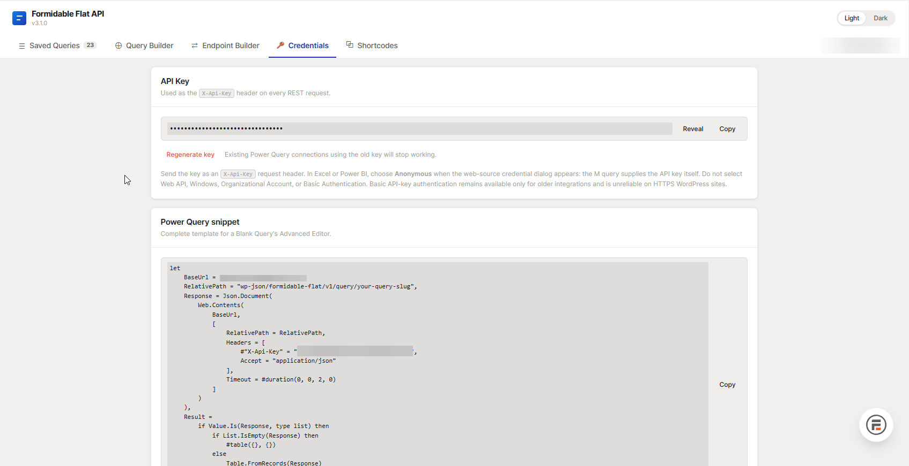
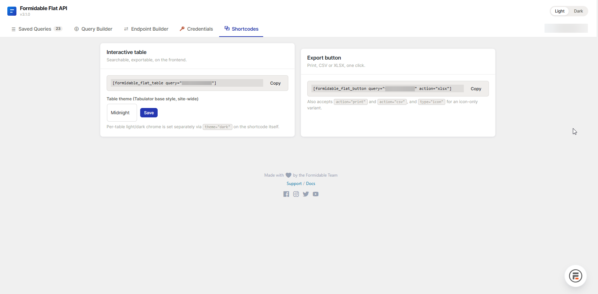

# Formidable Flat API


**The fastest way to get Formidable Forms data into Excel, Power BI, or a printed report — already flat, already labeled, already yours.**

Formidable stores repeater ("child form") entries as nested arrays keyed by numeric field ID. This plugin expands them into flat rows — one row per child entry, parent fields copied across, real field names as headers — and serves the result as JSON, CSV, XLSX, a print view, or an interactive front-end table. One saved query, one endpoint, one request.

---

## Why not just use Formidable's own API?

Formidable Forms sells an official **API add-on** (Business plan and up) that exposes raw entries over REST. It works, but it hands you the data the way Formidable stores it internally — not the way you actually want to look at it in a spreadsheet.

**The old way**, to get one flat, readable table in Power Query:

1. Query `/frm/v2/forms/{id}/fields` — a separate request just to get the field-ID → friendly-name map.
2. Query `/frm/v2/entries?form_id={id}` — entries come back with values keyed by numeric field ID, not name.
3. Merge the two queries in Power Query and rename every column from its field ID to the matching label.
4. Write your own M code to unnest the repeater/child-entry data, which is still deeply nested.
5. Filter out fields that were deprecated or removed from the form design years ago but still linger in every entry's meta.
6. Repeat all of the above, client-side, on every single refresh.

**The Flat API way:**

1. Point Power Query at one saved query endpoint.
2. Get back a flat table — real field names as headers, repeaters already expanded into rows, deprecated fields never selected in the first place, calculated columns already computed server-side.

No merge step. No rename step. No unnest step. Refresh is one HTTP call that returns rows already shaped the way you want them — which is where the speed comes from: Power Query re-runs every applied step on every refresh, so fewer, lighter steps means a faster refresh every time, not just a faster first load.

---

## Everything starts with the Query Builder

Every REST endpoint, Power Query snippet, shortcode, and export button this plugin produces comes from the same place: a visual **Query Builder** in wp-admin, not a config file or a support ticket.

1. **Source tables** — add one or more forms; for a multi-form merge, pick the shared key field on each.
2. **Join other saved queries** *(optional)* — pull in another saved query's own output columns, matched on a shared column.
3. **Fields** — tick what to include; entry metadata is grouped under its source form.
4. **Column order & aliases** — drag to reorder, rename any column for output.
5. **Filters** — AND-logic row filters (`=`, `!=`, `>`, `contains`, `is_empty`, …).
6. **Calculated columns** — formula columns, computed server-side.
7. **Live preview** — run it against real data before you save, right there in the builder.



Save it, and that one definition *is* the endpoint — every saved query's row in **Saved Queries** carries an **Export** menu that hands you a REST URL, a ready-to-paste Power Query expression, the interactive-table shortcode, print/CSV/Excel button shortcodes, and one-click downloads, all reading that same definition, all staying in sync automatically when you edit it:



The admin UI itself — Saved Queries, Query Builder, a legacy Endpoint Builder for hand-built raw URLs, Credentials, and a Shortcodes reference — is a **Svelte 5** single-page app: tabs switch instantly, no full-page wp-admin reload on every click.

---

## Features

- **Visual Query Builder** — pick source forms, fields, filters, joins, calculated columns, and sort order visually; one saved definition powers every REST endpoint, shortcode, and export.
- **Automatic repeater flattening** — one row per child entry, parent fields copied across.
- **Multi-form joins** — merge forms on a shared key field, or join saved queries to each other (`first`/`all`/`nearest_before` match modes, LEFT JOIN semantics — a join never silently drops a row).
- **Saved, reusable queries** — field selection, column order/aliases, filters, sort, joins, and calculated columns defined once, reused across REST, shortcodes, and every export format.
- **Calculated columns** — a server-side formula engine (arithmetic, text concatenation, `ROUND`/`ABS`/`MIN`/`MAX`/`SUM`/`CONCAT`/etc.) with no `eval()`, ever.
- **CSV, XLSX, and print exports** — one click, no external PHP libraries required for XLSX.
- **Power Query / Excel-ready by design** — the Credentials tab hands you a complete, ready-to-paste M expression per saved query.
- **Interactive front-end table** — `[formidable_flat_table]`, powered by Tabulator.js, with light/dark theming, per-row edit links, and client-side search/export.
- **Modern Svelte 5 admin UI** — a fast, five-tab single-page app instead of a stack of legacy wp-admin forms.
- **`X-Api-Key` authentication** — immune to the WordPress core Application Passwords bug that silently breaks HTTP Basic Auth on HTTPS sites.

---

## Formidable Flat API vs. Formidable's official API add-on

They're not mutually exclusive — a site can run both: the official API for two-way integrations (writing entries, firing webhooks), Flat API for reporting.

| | **Formidable Flat API** (this plugin) | **Formidable's official API add-on** |
|---|---|---|
| **Price** | Free | Requires Business license or above (paid annual plan) |
| **Primary use case** | Flat, spreadsheet-ready data export & reporting | General-purpose REST CRUD + outbound webhooks |
| **Repeater/child-entry flattening** | ✅ Automatic — one row per child entry, parent fields copied across | ❌ Returned as raw nested JSON, keyed by field ID; flattening left to you |
| **Field names in the response** | ✅ Real field labels, straight out of the box | ❌ Numeric field IDs — a second request against the fields endpoint is required just to label columns |
| **Multi-form joins** | ✅ Merge by shared key field (`/merged/...`), plus query-to-query joins with `first`/`all`/`nearest_before` (as-of) match modes | ❌ Not built in — fetch each form separately and join client-side |
| **Saved, reusable queries** | ✅ Named queries: field selection, column order/alias, filters, sort, joins, calc columns — one definition, reused everywhere | ❌ No concept of a saved query; every request repeats its own args |
| **Calculated columns** | ✅ Server-side formula engine, no `eval()` | ❌ Not available |
| **Deprecated/unused fields** | ✅ You choose exactly which fields appear — nothing stale leaks through | ❌ Every field ever added to the form shows up in every entry's meta, used or not |
| **CSV / XLSX export** | ✅ One-click export buttons, dependency-free XLSX writer | ❌ Not available |
| **Power Query / Excel-ready** | ✅ Purpose-built — flat JSON drops straight into `Table.FromRecords`; Credentials tab hands you a ready-to-paste M expression | ⚠️ Possible, but you write the field-mapping merge, header rename, and unnesting logic yourself, and it all re-runs on every refresh |
| **Print output** | ✅ `print` action on the export button | ❌ Not available |
| **Interactive frontend table** | ✅ `[formidable_flat_table]` shortcode (Tabulator.js, light/dark theme, per-row edit links, client-side search & export) | ❌ Not available (Formidable *Views*, a separate paid add-on, offers HTML display instead) |
| **Create / update / delete entries via REST** | ❌ Read-only by design | ✅ Full CRUD on entries, forms, and fields |
| **Outbound webhooks on submit** | ❌ Not in scope | ✅ "Send API data" form action (JSON/raw, POST/GET/PUT/PATCH/DELETE) |
| **Authentication** | `X-Api-Key` header — unaffected by the WordPress core Application Passwords bug that breaks Basic Auth on HTTPS | Basic Auth (global key) by default, or WordPress Application Passwords |
| **Official support** | Community / self-supported | Official Strategy11 support |

**Bottom line:** if you need Formidable data in Excel or Power BI without writing merge/rename/unnest transforms on every refresh, or want a filterable front-end table with export buttons, Flat API does that out of the box. If you need two-way sync — creating or updating entries from an external system, or firing a webhook on submission — that's what the official API add-on is for.

---

## Requirements

WordPress 5.8+, PHP 7.4+, Formidable Forms 5.0+, PHP `ZipArchive` (for XLSX).

## Install

Upload the ZIP through **Plugins → Add New → Upload Plugin**, or drop the folder into `wp-content/plugins/` and activate. An API key is generated on first visit to **Formidable → Flat API**.

## Connect Power Query / Excel

The **Credentials** tab supplies a ready-to-paste M expression. Or copy one from any saved query's **Export** menu.



```m
let
    BaseUrl      = "https://yoursite.com",
    RelativePath = "wp-json/formidable-flat/v1/query/my-query",
    Response = Json.Document(
        Web.Contents(BaseUrl, [
            RelativePath = RelativePath,
            Headers = [#"X-Api-Key" = "YOUR_API_KEY", Accept = "application/json"],
            Timeout = #duration(0, 0, 2, 0)
        ])
    ),
    Result = if Value.Is(Response, type list)
             then if List.IsEmpty(Response) then #table({}, {})
                  else Table.FromRecords(Response)
             else error "Unexpected response."
in Result
```

Select **Anonymous** when Excel prompts for credentials — the key travels in `X-Api-Key`, not the credential dialog.

## Shortcodes

Run any saved query straight from a front-end page — no REST call, no Power Query, just a shortcode. The **Shortcodes** tab generates the exact tag for you, per saved query:



```
[formidable_flat_button query="slug" action="print|csv|xlsx" label="Download"]
[formidable_flat_table  query="slug" theme="light|dark" edit_page_id="42"]
```

`formidable_flat_button` drops a single export/print button. `formidable_flat_table` renders the full interactive Tabulator table, with client-side search and export of exactly what's currently filtered. Both require a logged-in WordPress session.

## Full reference

See [PLUGIN.md](PLUGIN.md) for REST endpoints, query builder, calculated columns, shortcode parameters, and troubleshooting.

---

**License:** Source-available — © Controll IT Systems (Pty) Ltd. All rights reserved. This repository is published for demonstration purposes; it is not licensed for redistribution or resale. See [LICENSE](LICENSE) for full terms.
